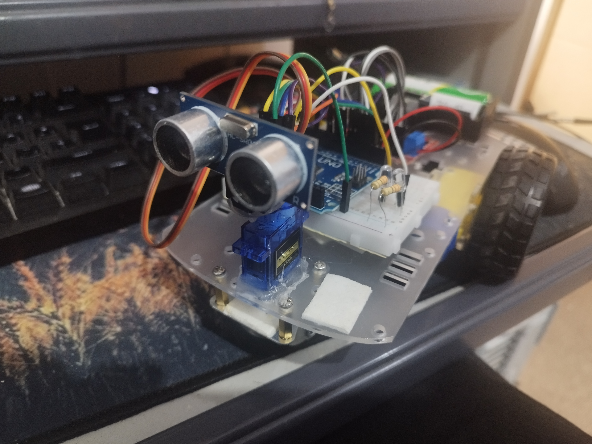
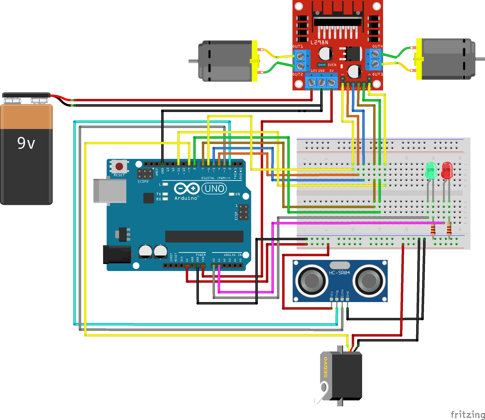

# Robot con Detección de Obstáculos

Este proyecto consiste en un robot autónomo que utiliza un sensor de ultrasonidos HC-SR04 para detectar obstáculos y tomar decisiones de navegación.

## Características
- Detección de obstáculos con sensor HC-SR04.
- Movimiento controlado por puente H L298N.
- Indicación visual con LEDs (verde: avanzando, rojo: detectando obstáculos).
- Priorización de giro a la derecha en caso de obstáculos.

## Requisitos
- Arduino Uno.
- Sensor HC-SR04.
- Puente H L298N.
- 2 motores DC.
- Batería de 9V.
- Servo motor (para mover el sensor).

## Instrucciones de uso
1. Conectar los componentes según el esquema de conexiones.
2. Subir el código `robot_deteccion_obstaculos.ino` al Arduino.
3. Encender el robot y observarlo navegar.

## Estructura del repositorio
- `src/`: Código fuente del proyecto.
- `hardware/`: Documentación del hardware.
- `docs/`: Documentación extendida.
- `media/`: Fotos y videos del proyecto.

## Capturas de pantalla

## Licencia
Este proyecto está bajo la licencia MIT. Consulta el archivo [LICENSE](LICENSE) para más detalles.

## Autor
[Pedro Carranza](https://github.com/draexx)