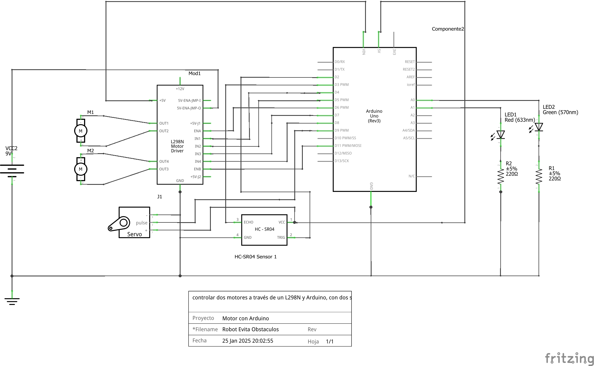

# Esquema de Conexiones
## Diagrama General

- **HC-SR04**:
  - `VCC` → 5V (Arduino).
  - `GND` → GND (Arduino).
  - `Trig` → Pin digital 2 (Arduino).
  - `Echo` → Pin digital 3 (Arduino).

- **Servo motor**:
  - `VCC` → 5V (Arduino).
  - `GND` → GND (Arduino).
  - `Señal` → Pin digital 9 (Arduino).

- **Puente H L298N**:
  - `IN1` → Pin digital 4 (Arduino).
  - `IN2` → Pin digital 5 (Arduino).
  - `IN3` → Pin digital 7 (Arduino).
  - `IN4` → Pin digital 8 (Arduino).
  - `ENA` → Pin digital 6 (Arduino).
  - `ENB` → Pin digital 11 (Arduino).
  - `VCC` → Batería (9V).
  - `GND` → GND (Arduino y batería).

- **LEDs**:
  - `LED verde` → Pin analógico A0 (Arduino).
  - `LED rojo` → Pin analógico A1 (Arduino).

## Conexiones al Arduino

| Componente | Pin Arduino | Función |
|------------|-------------|---------|
| Ultrasonido - Trigger | 2 | Salida para iniciar medición |
| Ultrasonido - Echo | 3 | Entrada para recibir tiempo |
| Servo Cabezal | 9 | Control PWM |
| L298N - ENA | 6 | PWM motor izquierdo |
| L298N - IN1 | 4 | Dirección motor izquierdo |
| L298N - IN2 | 5 | Dirección motor izquierdo |
| L298N - ENB | 11 | PWM motor derecho |
| L298N - IN3 | 7 | Dirección motor derecho |
| L298N - IN4 | 8 | Dirección motor derecho |
| LED Verde | A0 | Indicador avance |
| LED Rojo | A1 | Indicador obstáculo |

## Conexiones del L298N

| Pin L298N | Conexión |
|-----------|----------|
| OUT1, OUT2 | Motor izquierdo |
| OUT3, OUT4 | Motor derecho |
| +12V | Batería positivo |
| GND | Batería negativo y GND Arduino |
| 5V | 5V Arduino (si se usa puente) |

## Notas Importantes

- Asegúrate de conectar las tierras (GND) del Arduino y del L298N.
- Los LEDs deben conectarse con sus respectivas resistencias (220 ohm) a GND.
- El sensor ultrasónico requiere alimentación de 5V.